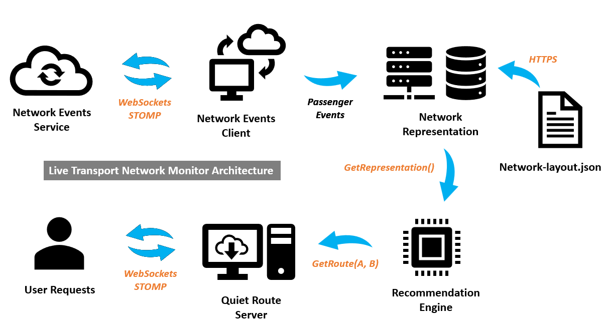

# Live Transport Network Monitor

## Overview

A Live Transport Network Monitor for a city train service to optimize the passenger load on the Underground Tubes during the busiest times. The system provides live itinerary recommendations based on real-time network load to avoid overcrowding.

## Project Goals

The primary objectives of this project are to:
1. Measure and monitor the network load in real-time.
2. Influence the itinerary choice of passengers by providing live recommendations through map services.
3. Implement a recommendation engine that generates "quiet routes," which are less busy and only marginally slower than the fastest available routes.

## Key Features

### Real-Time Network Load Measurement

- Journeys are recorded when passengers tap their electronic cards at station gates.
- Origin and destination data of every trip are captured, enabling real-time network load measurement.

### Influencing Passenger Itinerary Choices

- The train service provides live itinerary recommendations to popular map services like Google Maps, Apple Maps, and Citymapper.
- Approximately 15% of all trips are influenced by these recommendations.

### Quiet Route Recommendation Engine

- Generates Tube trips based on real-time network load.
- Characteristics of Quiet Routes:
  - Noticeably less busy.
  - Not much slower than the fastest route available.
- Quiet routes are offered to a small subset (approximately 20%) of users requesting itinerary recommendations.

## System Architecture


### Main Functional Blocks

1. **Network-Events Client**:
   - A WebSocket/STOMP client that connects to the network-events service and processes passenger events.
   - **Inputs**: Settings to establish a WebSocket/STOMP connection.
   - **Outputs**: Passenger events received from the network-events service.

2. **Network Representation**:
   - Maintains a view of the Underground network.
   - **Inputs**: Network layout JSON file and live passenger events.
   - **Output**: A network representation used to produce quiet route itineraries.

3. **Recommendation Engine**:
   - Generates quiet route travel recommendations based on a request to go from A to B.
   - **Inputs**: Network representation and a request to go from A to B.
   - **Outputs**: The itinerary recommendation.

4. **Quiet-Route Server**:
   - A WebSocket/STOMP server that handles user requests and forwards them to the recommendation engine.
   - **Inputs**: Settings to set up a WebSocket/STOMP server.
   - **Outputs**: STOMP frames in response to user requests for route recommendations.

### Supported Technologies

- **WebSockets**
- **TLS**
- **JSON**
- **STOMP**

### Data Management

- The main piece of data maintained in memory is the network representation, encapsulating both network layout information and current live crowding data.
- Communication with the network representation happens through API calls.
- The WebSocket/STOMP client and server convert STOMP messages into data suitable for the network representation interface.

### Hard Constraints

- The Underground network serves up to 5 million passenger journeys every day, leading to up to 10 million passenger events.
- To support up to 300 events per second with a 1-second latency, each event must be handled in approximately 3.3ms in a single-threaded implementation.
- Memory requirements are not critical since only current network crowding levels are tracked.
- To handle 6 requests per second with a 900ms latency, each itinerary recommendation must be produced within 150ms.

### Meta Requirements

- The code is thoroughly unit-tested, ensuring the recommendation engine is precise and resilient.
- The WebSocket client/server is resilient to network errors, with integration and stress tests implemented.
- The project has a solid build system for maintainability.

## Repository Structure
```
network-monitor 
├── .gitignore 
├── build                     // Build artifacts
│   └── .gitignore 
├── cmake                     // CMake settings
│   ├── FindFilesystem.cmake 
│   └── GetWinVer.cmake 
├── CMakeLists.txt            // Build config.
├── conanfile.py 
├── conanprofile.toml 
├── inc 
│   └── network-monitor       // Header files
│     ├── ***.h 
│     └── websocket-client.h 
├── src                       // Source files
│   ├── ***.cpp 
│   ├── websocket-client.cpp
│   └── main.cpp 
└── tests                     // Test files and data
    ├── cacert.pem 
    ├── ***.cpp 
    └── websocket-client.cpp
```

### Usage Instructions

1. **Clone the Repository**:
```bash
git clone https://github.com/pjsutar/network-monitor.git
cd network-monitor
```

2. **Create CMake build directory**:
```bash
mkdir build && cd build
```

3. **Install dependencies with Conan**:
```bash
cd build
conan install .. --profile ../conanprofile.toml --build missing
cd ..
```

4. **Build project with CMake**:
```bash
cd build
cmake .. -GNinja -DCMAKE_BUILD_TYPE=Release ninja
cd ..
```

### Conclusion
This project enhances the passenger experience on the Underground Tubes by providing real-time itinerary recommendations that optimize for less busy routes. By leveraging real-time data and integrating with popular map services, the system helps manage passenger load and reduce overcrowding during peak times.

The implementation is designed to handle up to 300 events per second with a latency of up to 1 second for event processing, ensuring the system can keep up with demand even during peak times. Additionally, the quiet-route recommendation engine can handle up to 6 requests per second with a maximum latency of 900ms, providing quick and efficient route suggestions. The system is thoroughly unit-tested for precision and resilience and includes integration and stress tests to ensure reliability under network errors. This solid foundation ensures maintainability and performance, contributing to an overall improved passenger experience.
